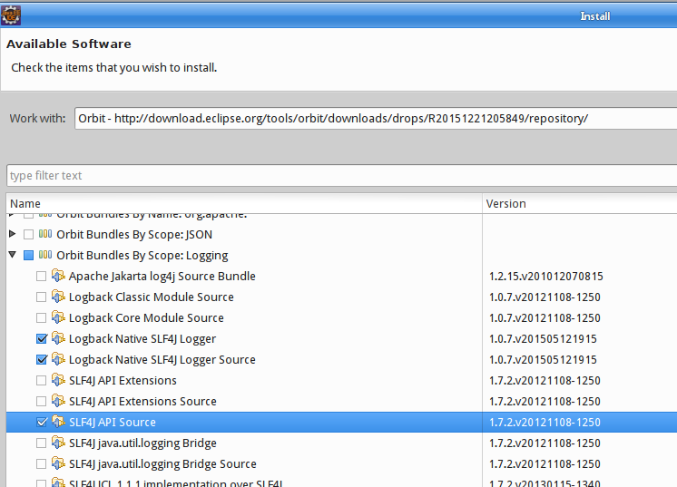

madura-eclipse
==

This Eclipse Plugin supports editing of Madura Rules and Madura Workflow files.
The Madura Suite makes use of rules and workflow definitions. Unlike similar products it keeps these
definitions in text files rather than maintaining them with a complex UI. But a helpful editor is always welcome and this
plugin provides two of them. One for the workflow definitions and one for the rules definitions. There are also creation wizards
for each to get you started, syntax checking and content assist while you edit, and an outline to help you navigate.
These are just editors, they do not provide a runtime environment.

Prerequisites
--
 
 * Eclipse Luna (4.4.0)
 * Java 1.8
 * The SLF4J OSGi package
 
To install SLF4J use the Orbit software update site:
Go into Eclipse>Help>Install New Software then Add...
Orbit
http://download.eclipse.org/tools/orbit/downloads/drops/R20151221205849/repository/

Now add the following options:

You should also add SLF4J API (which is not shown in the image because it is already installed).

Build the Plugin
--

 1. Run the maven build with goals `clean process-resources` in the top project to update the sub-projects with the correct versions and dependencies. These are copied from the templates directory and the maven dependencies.
 2. Refresh the workspace.
 3. Invoke Project>Build all from Eclipse. That will build the feature and plugin sub-projects.
 4. Open the update project's site.xml file in the editor. Click on Synchronize and then click on Build All.
 5. run maven again with goals `org.apache.maven.plugins:maven-assembly-plugin:single` which will create the zip file in the target directory. The zip file contains the plugin.

Testing
--

To test changes to the plugin run the plugin project with Run As>Eclipse Application

