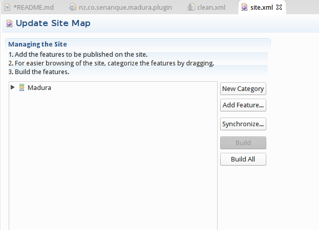

madura-eclipse
==

Eclipse plugin and associated projects (feature, update) to assist development of rules and workflow files.

Prerequisites
--
 
 * Eclipse Luna (4.4.0)
 * Java 1.8
 * The SLF4J OSGi package
 
To install SLF4J use the Orbit software update site:
Go into Eclipse>Help>Install New Software then Add...
Orbit
http://download.eclipse.org/tools/orbit/downloads/drops/R20151221205849/repository/

Now add the following options:

You should also add SLF4J API (which is not shown in the image because it is already installed).

Libraries
--

In the plugin project there is a lib directory containing jar files.
Those files will need to be updated to use a later version of Madura Rules and Madura Workflow when necessary.
Note that it is not necessary to include the full runtime dependency tree, just the selected subset. So there is no point using ivy or maven to source those libraries.

Build
--

The three projects (feature, plugin, update) can be built by invoking Project>Build all from Eclipse.
That will build the feature and plugin. To build the update project first run the clean.xml ant script, then open the
site.xml file in the editor. It should look like this:

Click on Synchronize and then Build All.
The resulting files are created in the update project ready for deployment on the web.

Testing
--

To test changes to the plugin run the plugin project with Run As>Eclipse Application

Usage
--

Documentation on usage is in the Madura projects documentation [Madura Rules](http://www.madurasoftware.com/madura-rules.pdf) and [Madura Workflow](http://www.madurasoftware.com/madura-workflow.pdf).
